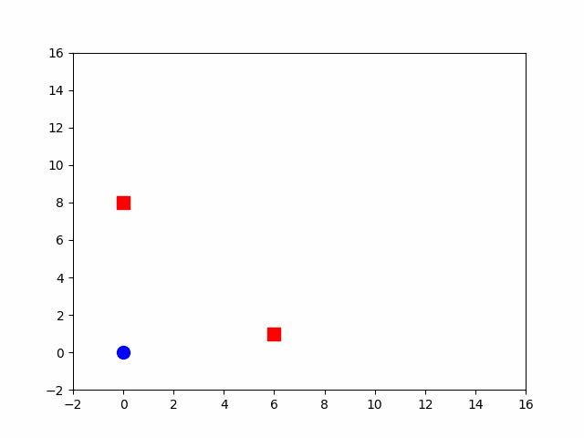

# Dynamic Avoidance Optimizer

## Introduction
This project implements a Dynamic Avoidance Optimizer (DAO) for path planning in dynamic environments. The DAO algorithm takes into account dynamic obstacles and generates a smooth path from a start point to a goal point while avoiding collisions with obstacles.

## Usage
To use the DAOptimizer class, you need to follow these steps:

1. Create an instance of the DAOptimizer class.
2. Set the start and goal points using the `setStart()` and `setGoal()` methods.
3. Add dynamic obstacles using the `addDyanmicObstacle()` method.
4. Initialize the initial path using the `init_path()` method.
5. Smooth the initial path using the `smooth()` method.

Here is an example usage:

```python
from DAOptimizer import DAOptimizer

# Create an instance of the DAOptimizer class
optimizer = DAOptimizer()

# Set start and goal points
start_point = wayPoint(0, 0, 0)
goal_point = wayPoint(14, 14, 0)
optimizer.setStart(start_point)
optimizer.setGoal(goal_point)

# Add dynamic obstacles
optimizer.addDyanmicObstacle(obstacle1)
optimizer.addDyanmicObstacle(obstacle2)

# Initialize and smooth the path
initial_path = optimizer.init_path()
smoothed_path = optimizer.smooth()
```
Running `python3 DAOptimizer.py` to see a given example of dynamic avoidance.
 